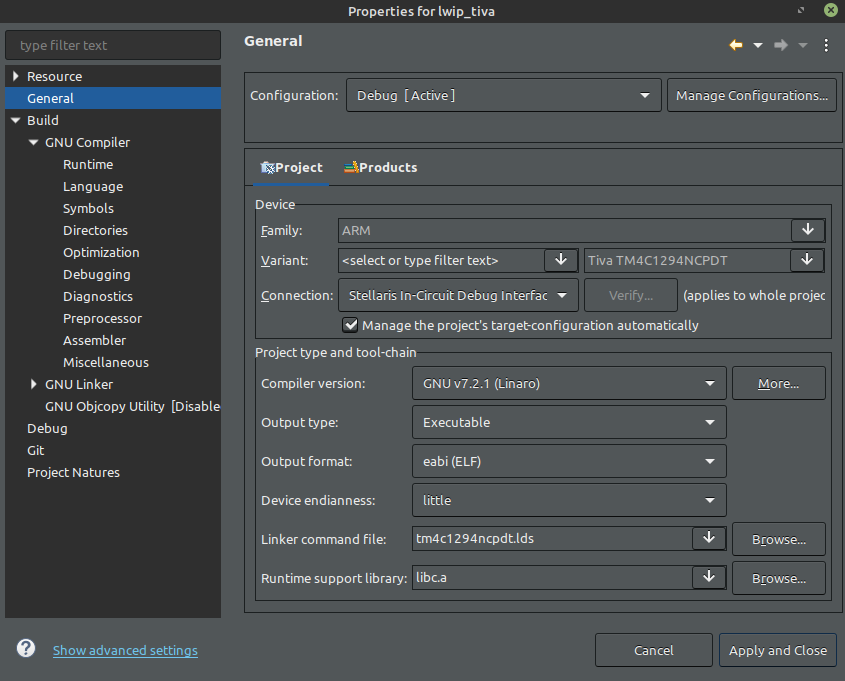
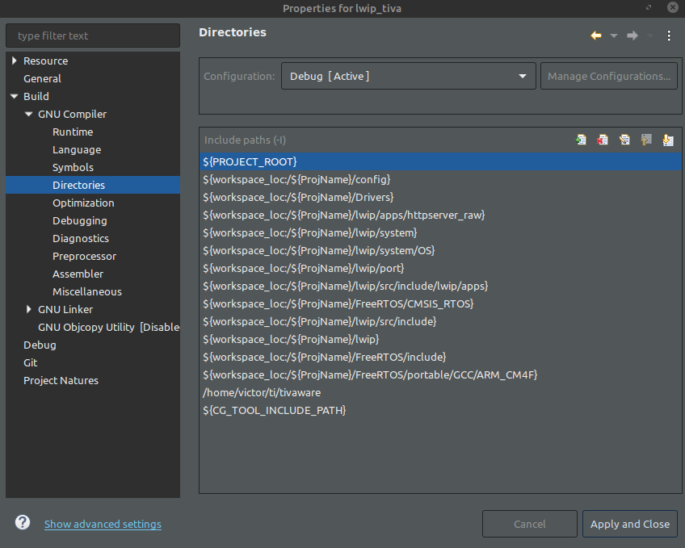
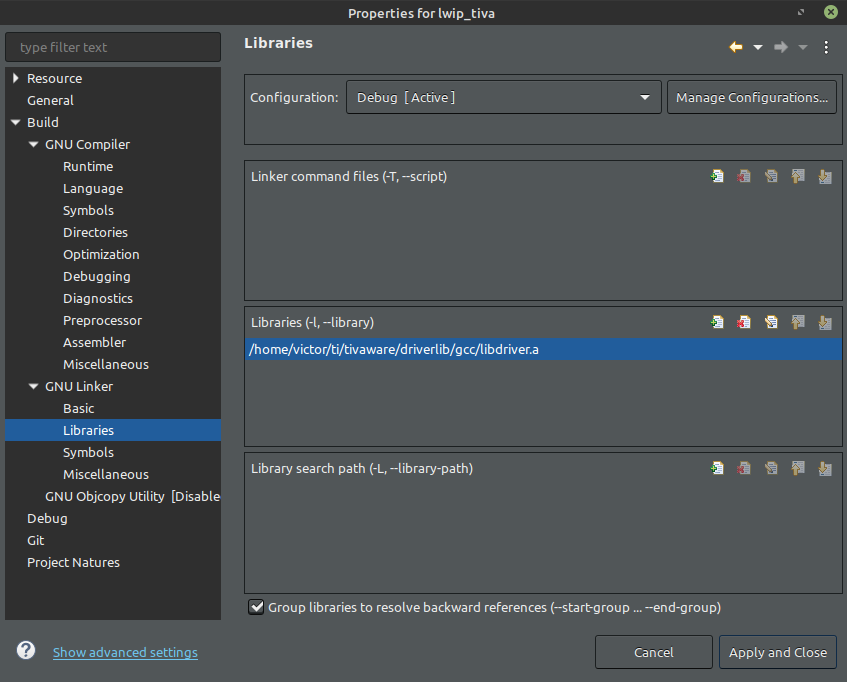

# tiva_lwIP_httpserver
lwIP application using with FreeRTOS on Tiva Connected TM4C1294XL.

## Requirements
* FreeRTOS v10.4.0
* lwIP Stable-2.1.2

The project was developed on **Code Composer Studio Version: 10.1.0.00010**

The CCS Project was created and configurated exactly like the images below:

